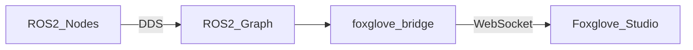

# ros2_shortcut

ROS 2에서 **토픽/서비스(ROS graph)**를 웹에서 확인하고, **이미지/3D(PointCloud2, TF, RobotModel 등)**까지 시각화하기 위한 “빠른 구성” 메모/예제 프로젝트입니다.  
기본 아이디어는 **ROS 2 ↔ (Bridge) ↔ WebSocket ↔ Foxglove Studio** 흐름입니다.

## 목표
- ROS 2 Jazzy 환경에서 토픽/서비스를 확인하고
- 카메라 이미지, TF, PointCloud2 같은 3D/센서 데이터를
- **Foxglove Studio(웹/데스크톱)**에서 로컬/같은 LAN에서 쉽게 시각화

## 핵심 개념
- **ROS graph**: 노드/토픽/서비스/액션/파라미터의 전체 관계(발견/discovery 포함)
- **ROS_DOMAIN_ID**: 같은 DDS 도메인에서 서로 발견되도록 “네트워크 그룹”을 나누는 설정  
  - 웹 UI를 자동으로 제공하는 기능은 아님
  - 다른 PC에서 `ros2 topic list`가 보이게 하려면 같은 `ROS_DOMAIN_ID` + 같은 네트워크가 기본 전제
- **Bridge (`foxglove_bridge`)**: ROS 2 메시지를 **WebSocket**으로 중계해 Foxglove가 읽게 해주는 컴포넌트
- **Foxglove Studio**: 토픽을 구독해 **Image / 3D / Plot / Raw Messages** 등으로 시각화하는 클라이언트

## 아키텍처(데이터 흐름)


## 빠른 시작(개념 절차)
> 실제 설치/실행 커맨드는 환경에 따라 달라질 수 있어요(패키지명, 포트, 방화벽 등).  
> 이 저장소에서는 “어떻게 구성하는가”에 초점을 둡니다.

- **robot_pc(ROS 2가 도는 머신)**:
  - `foxglove_bridge` 설치
  - 브리지를 **0.0.0.0 바인드**로 실행해서 LAN에서도 접근 가능하게 구성
  - 방화벽(UFW 등)에서 브리지 포트 인바운드 허용
- **viewer_pc(Foxglove를 여는 머신)**:
  - Foxglove Studio에서 WebSocket 주소로 접속
    - 같은 PC: `ws://localhost:<port>`
    - 같은 LAN의 다른 PC: `ws://<robot_pc_ip>:<port>`

## Foxglove에서 자주 쓰는 패널
- **Image**: `/camera/.../image` 계열 토픽 보기
- **3D**: TF 기반으로 프레임/로봇/포인트클라우드 시각화
  - TF: `/tf`, `/tf_static`
  - PointCloud2: `/points`, `/velodyne_points` 등
  - (선택) RobotModel: URDF(`/robot_description`)가 있으면 로봇 모델 표시 가능
- **Raw Messages**: 토픽 메시지 payload를 그대로 확인(디버깅에 유용)
- **Plot**: 수치 토픽(예: 센서 값, 제어 값) 시계열 플롯

## 추천 폴더 구조(이 저장소를 구성한다면)
```text
ros2_shortcut/
  README.md

  docs/
    concepts.md              # ROS graph / ROS_DOMAIN_ID / Bridge 개념 정리
    networking.md            # 같은 PC/LAN/원격에서 접속할 때 체크리스트(방화벽 등)
    foxglove_panels.md       # Image/3D/Plot 설정 팁, 자주 쓰는 토픽 예시

  ros/
    launch/
      foxglove_bridge.launch.py   # 브리지 실행 런치(포트, 바인드, 네임스페이스 등)
    config/
      foxglove_bridge.yaml        # (선택) 브리지 옵션/화이트리스트 등 설정 파일

  scripts/
    env.sh                    # (선택) ROS_DOMAIN_ID, RMW 설정 등 편의 스크립트
    run_bridge.sh             # (선택) 브리지 실행 래퍼(로깅/포트 고정 등)

  examples/
    sample_topics.md          # 이미지/TF/PointCloud 테스트 토픽 예시와 확인 방법
```

## 범위(Out of Scope)
- 인터넷을 통한 원격 공개(보안/인증/리버스 프록시/터널링 등)는 별도 설계가 필요합니다.
- ROS 2 토픽/서비스 “목록만 보기”는 브리지 없이도 가능하지만, 이 저장소는 주로 **시각화**에 초점을 둡니다.

## 참고
- ROS 2 배포판: **Jazzy**
- 시각화 툴: **Foxglove Studio**
- 브리지: **foxglove_bridge**