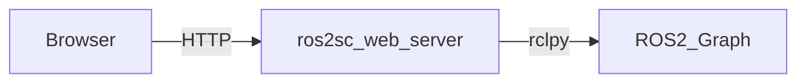

# ros2_shortcut

ROS 2에서 **지금 어떤 토픽/서비스/노드가 있는지**, 그리고 **각 토픽/서비스의 타입이 무엇인지**를 웹에서 빠르게 확인하기 위한 “ROS 2 Web Inspector” 프로토타입입니다.

이 저장소의 목표는 `ros2 topic list`, `ros2 service list` 같은 CLI를 웹 UI로 옮겨서, 브라우저에서 탐색/검색/확인이 가능하게 만드는 것입니다.

## 목표
- ROS 2 Jazzy 환경에서 아래 정보를 **웹 UI**로 확인
  - 토픽 목록 + 각 토픽의 타입
  - 서비스 목록 + 각 서비스의 타입
  - 노드 목록(이름/네임스페이스)
  - (선택) 시스템에 설치된 ROS 패키지 목록(ament index 기준)
- 기본은 **로컬(127.0.0.1)에서만 접근** 가능하게 운영

## 핵심 개념
- **ROS graph**: 노드/토픽/서비스/액션/파라미터의 전체 관계(발견/discovery 포함)
- **ROS_DOMAIN_ID**: 같은 DDS 도메인에서 서로 발견되도록 “네트워크 그룹”을 나누는 설정  
  - 웹 UI를 자동으로 제공하는 기능은 아님
  - 다른 PC에서 `ros2 topic list`가 보이게 하려면 같은 `ROS_DOMAIN_ID` + 같은 네트워크가 기본 전제
- **Web Inspector (`ros2sc_web`)**: ROS 2 그래프를 읽어 **HTTP API + 웹 UI**로 제공하는 로컬 웹 서버

## 아키텍처(데이터 흐름)


## 빠른 시작(개념 절차)
> 실제 설치/실행 커맨드는 환경에 따라 달라질 수 있어요(패키지명, 포트, 방화벽 등).  
> 이 저장소에서는 “어떻게 구성하는가”에 초점을 둡니다.

- **robot_pc(ROS 2가 도는 머신)**:
  - `ros2sc_web` 서버를 실행(기본: 127.0.0.1)
- **viewer_pc(브라우저를 여는 머신)**:
  - 같은 PC에서 브라우저로 `http://127.0.0.1:<port>` 접속
  - (옵션) LAN에서 보려면 바인드 주소를 `0.0.0.0`으로 변경하고 방화벽을 열어야 함

## 실행 방법
 - 실행 가이드: `docs/how_to_run.md`

## 왜 웹 UI로 만들까?
CLI(`ros2 topic list`, `ros2 service list`, `ros2 interface show` 등)도 가능하지만, 웹 UI로 만들면 아래가 편해집니다.

- **검색/필터**: 토픽/서비스 이름을 빠르게 필터링
- **한 화면 요약**: 토픽/서비스/노드/패키지를 동시에 보기
- **공유**: (옵션) 같은 PC 또는 내부망에서 팀원과 상태를 쉽게 공유

## 추천 폴더 구조(이 저장소를 구성한다면)
```text
ros2_shortcut/
  README.md

  docs/
    concepts.md              # ROS graph / ROS_DOMAIN_ID / Bridge 개념 정리
    networking.md            # 같은 PC/LAN/원격에서 접속할 때 체크리스트(방화벽 등)
    how_to_run.md            # 실행 방법(설치/빌드/실행/연결)

  ros/
    launch/
      foxglove_bridge.launch.py   # 브리지 실행 런치(포트, 바인드, 네임스페이스 등)
    config/
      foxglove_bridge.yaml        # (선택) 브리지 옵션/화이트리스트 등 설정 파일

  scripts/
    env.sh                    # (선택) ROS_DOMAIN_ID, RMW 설정 등 편의 스크립트
    run_bridge.sh             # (선택) 브리지 실행 래퍼(로깅/포트 고정 등)

  examples/
    sample_topics.md          # 이미지/TF/PointCloud 테스트 토픽 예시와 확인 방법

  ros2sc_web/                 # (프로토타입) ROS 2 그래프 웹 인스펙터 패키지
    launch/
      web_inspector.launch.py
```

## 범위(Out of Scope)
- 인터넷을 통한 원격 공개(보안/인증/리버스 프록시/터널링 등)는 별도 설계가 필요합니다.
- ROS 2 토픽/서비스 “목록만 보기”는 브리지 없이도 가능하지만, 이 저장소는 주로 **시각화**에 초점을 둡니다.

## 참고
- ROS 2 배포판: **Jazzy**
- 시각화 툴: **Foxglove Studio**
- 브리지: **foxglove_bridge**